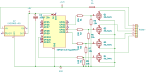

# Closet LED Strip — ESP32-C3 RGBW Controller

ESP32-based smart controller for a dumb 12V RGBW LED strip (60 LEDs/m, ~15 feet across 8 segments) installed behind open shelving in a closet. Runs ESPHome, integrated with Home Assistant.

## What it does

- Controls R/G/B/W channels independently via PWM
- All 8 segments wired in parallel — treated as one unified light
- Exposes as a native RGBW light entity in Home Assistant
- Powers the ESP32 from the same 12V supply via onboard buck converter

## Hardware

| Component | Value / Part |
|---|---|
| Microcontroller | ESP32-C3 SuperMini |
| MOSFETs | 4x IRLZ44N (one per channel) |
| Gate resistors | 4x 100Ω |
| Gate pull-downs | 4x 10kΩ |
| Supply decoupling | 100µF 25V electrolytic |
| Buck converter | LM2596 (12V → 5V for ESP32) |
| Supply | 12V 10A BTF |
| Strip | RGBW 60 LEDs/m, ~4.6m total |
| Wire | 18AWG stranded on power runs |

## Schematic

## Power

- 12V supply feeds strip and buck converter in parallel
- Fuse on V+ supply lead before the split (5A)
- 18AWG wire handles the current comfortably at this length with no noticeable voltage drop end-to-end

## Firmware

ESPHome with `ledc` PWM outputs. Four channels grouped as a single `rgbw` light entity.

## Notes

- Same topology as the Dioder retrofit, extended to four channels for the white channel.
- Gate pull-downs prevent spurious MOSFET activation during ESP32 boot.
- Built on perfboard.
